# 跟着 DS 学习 RL（一）：核心概念

友链：
* [跟着 DS 学习 ReinforcementLearning](./Learn_RL_From_DeepSeek_0.md)
* [跟着 DS 学习 RL（二）：经典算法分类与基本算法](./Learn_RL_From_DeepSeek_2.md)
* [跟着 DS 学习 RL（三）：PPO & GRPO](./Learn_RL_From_DeepSeek_3.md)

## 大纲

> ### **阶段1：强化学习核心概念（3-4小时）**
> 
> *   **目标**：理解强化学习的基本框架和术语
> *   **关键内容**：
>     1.  **马尔可夫决策过程（MDP）**：状态（State）、动作（Action）、奖励（Reward）、策略（Policy）
>     2.  **价值函数**：状态价值函数 $V(s)$，动作价值函数 $Q(s,a)$
>     3.  **贝尔曼方程**：理解如何递归计算价值
>     4.  **探索与利用的平衡**：$\epsilon$-greedy、UCB等简单策略
> *   **学习资源**：
>     *   视频：[RL基础讲解](https://www.youtube.com/watch?v=2pWv7GOvuf0)（30分钟）
>     *   文字：[OpenAI Spinning Up - RL基础](https://spinningup.openai.com/en/latest/spinningup/rl_intro.html)

大概实际用时 2.5小时（有一些没深入理解了）

DS 给了两个学习资料， 第一印象感觉 OpenAI 的 [Spinning Up](https://spinningup.openai.com/en/latest/spinningup/rl_intro.html) 更加权威系统些。

## 主要概念

RL 是对代理（Agent）的研究以及它们如何通过反复试验学习，是代理可以学习行为以实现其目标的方式。

它正式的想法是，奖励或惩罚代理人的行为，这使得将来更有可能重复或放弃这种行为。

可以用来做什么：

*   AlphaGo
*   Dota2
*   ...

主要两个元素是：

*   **<font color="red">Agent</font>**：特征
*   **<font color="red">Environment</font>**：环境

一些关于他们的定义：

*   **Environment** 是 **Agent** 生活并与之互动的世界， 互动的每一步中，代理都会「看到」对世界状态的观察， 然后决定采取行动。
*   **Environment** 会由 **Agent** 改变， 也可能自行改变。
*   **Agent** 还能感知环境的奖励信号， 这个数字告诉它当前世界状态的好坏。
*   **Agent** 目标是最大化其累积奖励。 （called **return**）

一些其他重要术语：（翻译 & 解释由 DS 生成）

*   **<font color="red">States and Observations</font>**
    
    *   **翻译**：状态与观测
    *   **解释**：
        *   **状态**：环境的完整内部描述（如游戏的全部隐藏信息）。
        *   **观测**：智能体感知到的部分环境信息（如摄像头图像）。
        *   **区别**：状态是环境的真实全貌，观测是智能体的局部视角（部分可观测性问题）。
    *   实现：
        *   常常以 real-valued vector（实向量） / matrix（矩阵） / higher-order tensor （高阶张量）来描述
        *   比如：
            *   视觉可以以 RGB 矩阵描述
            *   机器人的状态， 可以由关节角度和速度组成的实向量描述
*   **<font color="red">Action Spaces</font>** 
    
    *   **翻译**：动作空间
    *   **解释**：
        *   智能体可执行动作的集合。
        *   **离散动作空间**：有限、可枚举的动作（如围棋落子位置）。
        *   **连续动作空间**：连续值动作（如方向盘转向角度）。
*   **<font color="red">Policies</font>**
    
    *   **翻译**：策略
    *   **解释**：
        *   智能体选择动作的规则，映射状态到动作。
        *   **Deterministic Policies 确定性策略**：直接输出明确动作（如检测障碍物时刹车），通常 μ 描述。  
            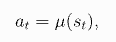
        *   **Stochastic Policies 随机策略**：输出动作概率分布（如探索时随机尝试），通常 π 描述。  
            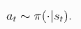
    *   其他：
        *   策略本质是 Agent 的大脑，有些称呼会将 Proxy 代替 Agent 。
        *   RL 中， 可以通过使用参数「比如神经网络的 weight 和 bias」来描述策略。
        *   θ 或者 φ，然后将其作为策略符号上的下标写，表示这些参数化的策略
    *   确定性策略
        ```
        # torch.nn软件包的Pytorch中连续动作空间构建简单确定性策略的代码段：
        pi_net = nn.Sequential(
            nn.Linear(obs_dim, 64),
            nn.Tanh(),
            nn.Linear(64, 64),
            nn.Tanh(),
            nn.Linear(64, act_dim)
        )
        ```

        *   > 这构建了一个多层感知器（MLP）网络，其两个尺寸为64的隐藏层和  激活功能。如果`obs`是包含一批观测值的Numpy数组，则可以使用`pi_net`来获取一批动作，如下所示：
            > 
            > obs\_tensor \= torch.as\_tensor(obs, dtype\=torch.float32)
            > actions \= pi\_net(obs\_tensor)
            
        *   obs\_dim 是观察所对应的向量， 整个神经网络是 obs\_dim \* 64 ↔ 64 \* 64 ↔ 64 ↔ act\_dim 的，act\_dim 是行为对应的向量
        *   此神经网络策略， 用于从一个 obs\_tensor 获取一个对应的 action
        *   Tanh 激活功能不知道是什么东西， 后面有兴趣看一下
    *   随机策略
        *   categorical policies（分类策略）：常见用于离散的动作空间
            *   跟上述的确定性策略类似， 不过输出层输出的是概率， 而不是具体的 Action
        *   diagonal Gaussian policies （对角高斯策略）：常见的用于连续的动作空间
            *   暂时略过，有时间学习下
        *   两个重要的关键计算：
            *   sampling actions from the policy：从策略中抽样行动
            *   computing log likelihoods of particular actions：计算特定动作的对数似然性
        *   疑问：对于连续的动作空间， 进行随机策略的流程是先将连续的动作空间变为离散的动作空间， 然后最大似然匹配吗？ （都不是，没深究 DS 回答）
            *   DS 回答...
                
                在连续动作空间中，随机策略的实现并不需要将动作空间离散化，也不依赖最大似然匹配。以下是连续动作空间下随机策略的核心流程和原理：
                
                * * *
                
                ### **1\. 连续动作空间的策略建模**
                
                *   **直接参数化概率分布**：  
                    策略输出一个**连续概率分布**（如高斯分布、Beta分布等）的参数，例如：
                    
                    *   高斯分布：输出均值 $\mu$ 和方差 $\sigma^2$
                    *   Beta分布：输出形状参数 $\alpha, \beta$
                    *   例如，策略网络 $\pi_\theta(a|s)$ 可能输出 $\mu_\theta(s)$ 和 $\sigma_\theta(s)$
                *   **动作采样**：  
                    从该分布中**直接采样连续动作**，而非离散化：
                    $a \sim \mathcal{N}(\mu_\theta(s), \sigma_\theta^2(s))$
                    
                
                * * *
                
                ### **2\. 策略优化方法**
                
                *   **策略梯度（Policy Gradient）**：
                    
                    *   目标：通过梯度上升最大化期望回报 $J(\theta) = \mathbb{E}_{\tau \sim \pi_\theta}[G(\tau)]$
                    *   更新公式：  
                        $\theta \leftarrow \theta + \alpha \nabla_\theta J(\theta)$
                    *   **梯度计算**：  
                        利用似然比技巧（Likelihood Ratio Trick），梯度可分解为：  
                        $\nabla_\theta J(\theta) = \mathbb{E}_{\tau \sim \pi_\theta} \left[ \sum_{t=0}^T \nabla_\theta \log \pi_\theta(a_t|s_t) \cdot G_t \right]$
                        其中 $G_t$ 是从时刻 $t$ 开始的累积回报。
                *   **近似策略优化（PPO、TRPO）**：
                    
                    *   通过约束策略更新的幅度（如KL散度或裁剪目标函数），避免训练不稳定。
                    *   例如，PPO的目标函数：  
                        $L^{\text{CLIP}}(\theta) = \mathbb{E} \left[ \min \left( \frac{\pi_\theta(a|s)}{\pi_{\theta_{\text{old}}}(a|s)} A(s,a), \text{clip}\left(\frac{\pi_\theta(a|s)}{\pi_{\theta_{\text{old}}}(a|s)}, 1-\epsilon, 1+\epsilon\right) A(s,a) \right) \right]$
                
                * * *
                
                ### **3\. 连续动作空间 vs 离散动作空间的关键区别**
                
                * **特性**
                    * **离散动作空间**
                        * **策略输出**: 动作概率分布（如Softmax）
                        * **动作选择**: 按概率采样离散动作
                        * **优化难点**: 高维动作空间时计算量大
                        * **典型算法**: DQN、Q-Learning
                    * **连续动作空间**
                        * **策略输出**: 连续分布参数（如高斯分布的 $(\mu, \sigma)$）
                        * **动作选择**: 从连续分布中采样动作
                        * **优化难点**: 需处理连续空间的探索和局部最优问题
                        * **典型算法**: PPO、TRPO、SAC（Soft Actor-Critic）
                
                * * *
                
                ### **4\. 为什么不需要离散化？**
                
                *   **维度灾难**：  
                    连续动作空间本身维度高，离散化会导致动作数量爆炸（如机械臂控制有6个自由度，每个维度离散为10档，总动作数为 $(10^6)$）。
                *   **信息损失**：  
                    离散化会丢失动作的精细控制能力（如自动驾驶中方向盘转向角度需要连续调节）。
                *   **策略表达能力**：  
                    直接建模连续分布能更灵活地描述复杂动作分布（如多峰分布）。
                
                * * *
                
                ### **5\. 最大似然匹配的误区**
                
                *   **最大似然估计（MLE）** 在监督学习中用于拟合数据分布，但强化学习的策略优化目标是**最大化累积奖励**，而非匹配数据集。
                *   在策略梯度中，虽然会计算 $(\log \pi_\theta(a|s))$，但其作用是通过梯度调整参数 $(\theta)$ 以增加高回报动作的概率，而非直接最大化动作的似然。
                
                * * *
                
                ### **6\. 随机策略的典型应用场景**
                
                *   **机器人控制**：  
                    连续动作（如关节扭矩、速度）需从高斯分布中采样以实现平滑控制。
                *   **金融交易**：  
                    交易量或价格调整需连续动作，随机策略可探索市场动态。
                *   **游戏AI**：  
                    角色移动或技能释放需精细控制，连续策略比离散策略更自然。
                
                * * *
                
                ### **总结**
                
                连续动作空间的随机策略直接建模动作的概率分布（如高斯分布），通过策略梯度方法优化分布参数，无需离散化动作空间或依赖最大似然匹配。其核心优势在于：
                
                1.  避免维度灾难和动作信息损失；
                2.  通过梯度优化直接关联动作概率与累积奖励；
                3.  适用于需精细控制的复杂任务。
                
*   **<font color="red">Trajectories</font>**：     
    *   **翻译**：轨迹（或回合），也被称作 episodes or rollouts
    *   **解释**：
        *   交互过程中的状态、动作、奖励序列：( \\tau = (s\_0, a\_0, r\_0, s\_1, a\_1, r\_1, \\dots) )。
            *   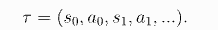
        *   **用途**：评估策略或训练模型（如蒙特卡洛方法）。
    *   流程：
        *   第一个状态 s0，从起始状态分布中所集采样：
            *   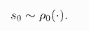
        *   根据 natural laws of the environment，计算出来 st+1
            *   确定性的：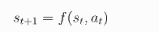
            *   随机的：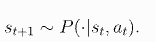
*   **<font color="red">Return And Different Formulations of Return</font>**
    
    *   **翻译**：回报的不同定义形式
    *   **解释**：
        *   **总回报**：轨迹中所有奖励之和：$G = r_0 + r_1 + \dots$
        *   **折扣回报**：引入折扣因子 $\gamma$ 平衡远近奖励：$G = \sum_{t=0}^{\infty} \gamma^t r_t$
        *   **平均奖励**：长期每步的平均奖励（用于无限时域任务）
    *   内容：
        *   有的写做 $R$，有的写做 $G$
        *   有的写做 R， 有的写做 G 
        *   奖励  在加强学习中至关重要， 其由前状态，刚刚采取的行动以及世界的下一个状态定义：  
            *   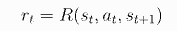
            *   常常简化为更少的依赖：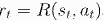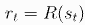
        *   Agent 的目的是最大化轨迹上的某些部分的累计 reward：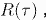
        *   **finite-horizon undiscounted return：有限时域无折扣回报**
            *   **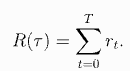**
            *   **最大化有限窗口中的 reward 之和**
        *   **infinite-horizon discounted return：无限时域有折扣回报**
            *   **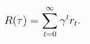**
            *   **最大化加权的 reward 之和（加权主要为的是收敛，方便助学中的处理）**
*   **<font color="red">The RL Optimization Problem</font>**
    
    *   **翻译**：强化学习的优化问题
    *   **解释**：
        *   目标：找到最大化期望累积回报的最优策略 ($\pi^*$)。
        *   数学形式：$(\pi^* = \arg\max_\pi \mathbb{E}_{\tau \sim \pi}[G(\tau)])$。
        *   **方法**：策略梯度、Q-Learning、Actor-Critic 等算法。
    *   内容：
        *   不论 Policy 和 Return 是什么方式， Agent 的目的就是优化 Policy 中的参数， 使得 Return 最大化。
        *   假设 Policy 和 Return 都是 stochastic 随机的，T-Step 轨迹为：  
            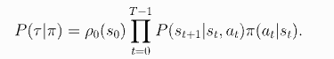  
            （这种公式都有点忘了， 看起来 | 区分了变量和值）
        *   回报：
            *   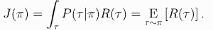
        *   则最优政策：
            *   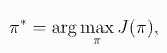
            *   变为找到最大化累积回报时的 $\pi$
*   **<font color="red">Value Functions</font>**
    
    *   **翻译**：价值函数
    *   **解释**：
        *   **状态价值函数 ($V(s)$ )**：状态 ($s$) 下遵循策略的期望回报：  
            ($V^\pi(s) = \mathbb{E}_{a \sim \pi} [r(s,a) + \gamma V^\pi(s')]$)。
        *   **动作价值函数 ($Q(s,a)$ )**：状态 ($s$) 选择动作 ($a$) 后的期望回报：  
            ($Q^\pi(s,a) = \mathbb{E}_{a \sim \pi} [r(s,a) + \gamma V^\pi(s')]$)。
        *   **用途**：评估长期价值（如 Q-Learning 依赖 ($Q(s,a)$)）。
    *   内容：、
        *   注意， 价值函数是期望，而回报函数是具体值
        *   知道一个 state，或者一个 state-value 对的价值是重要的。这里的价值指的是按照这个 state， 或者 state-value 对， 得到的预期 return
        *   基本上所有的 RL algorithm 都含有值函数
        *   几种主要价值函数：（文档解释不清楚， 让 ds 补充了下）
            *   On-Policy Value Function（同策略状态价值函数）：
                *   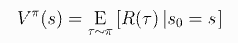
                *   一直遵循 $\pi$， 得到的最终 Return
                *   **应用场景**：
                    *   **策略评估（Policy Evaluation）**：计算当前策略的性能（如动态规划中的迭代策略评估）。
                    *   **基于状态的策略改进**：通过比较不同策略的 ($V^\pi(s)$) 选择更优策略。
            *   On-Policy Action-Value Function（同策略动作价值函数）
                *   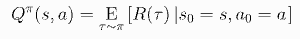
                *   第一次行为是 $a$（而不是 $\pi$ 策略预计的）， 最终的 Return
                *   **应用场景**：
                    *   **策略改进（Policy Improvement）**：通过选择使 ($Q^\pi(s, a)$) 最大的动作来优化策略（如策略迭代）。
                    *   **基于动作的探索**：指导智能体在特定状态下尝试高价值动作（如 $(\epsilon)$-贪婪策略）。
            *   Optimal Value Function（最优状态价值函数）
                *   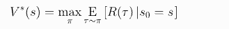
                *   理论最优性能， 与具体策略无关
                *   **应用场景**：
                    *   > **理论分析**：作为强化学习问题的全局最优解基准。
                        
                    *   **值迭代（Value Iteration）**：直接逼近 ($V^*$) 以导出最优策略。
            *   Optimal Action-Value Function（最优动作价值函数）
                *   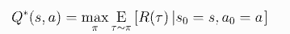
                *   添加了个第一个 action $a$
                *   **应用场景**：
                    *   **Q-learning**：直接学习 ($Q^*$) 以绕过显式策略（如无模型强化学习）。
                    *   **最优策略提取**：通过 ($ \pi^*(s) = \arg\max_{a} Q^*(s, a) $) 得到确定性最优策略。

### The Optimal Q-Function and the Optimal Action

最优动作价值函数和对应的 action 之间有一定联系。 上述说了， 最优价值函数就是， 一开始执行 $a$， 然后后面都执行无视实际值的最优策略。

所有， 其他条件都有的时候， 最优的行为就能确认了，为：最大化最有价值函数的 $a$。

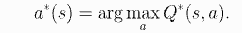

  

一些基础理论和引理
---------

### Bellman Equations

贝尔曼方程：四个价值函数都遵守的「自洽方程」。

基本思想：The value of your starting point is the reward you expect to get from being there, plus the value of wherever you land next.

看起来是个动态规划（或者递归）的概念：

*   Value(起点）= Reward(起点）+ Value（下一步）

对于 on-policy（同策略）

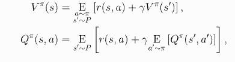

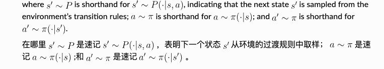

这里有点难懂了， 看下是如何演变的

.png)

对于同策略状态价值函数：一直执行同策略， 最终计算出来的 R 的积分。按照上面的动态规划就是

当前的 reward 加上下一个步骤的价值函数。

  

所以对于最优的两个价值函数也是同理

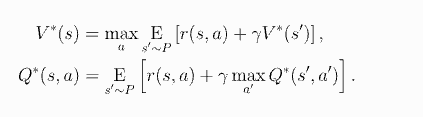

bellman 方程证明了一个事实：

当 Agent 选择动作时， 它必须选择会导致最高价值的动作。

  

### Advantage Functions 优势函数

有时， 选择 action 不需要全局最优， 只要比平均好就行。

我们通过 advantage funtion 来量化这个相对优势

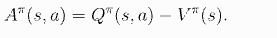

其实就是同策略的对应行动价值 - 同策略状态价值

  

探索与利用的平衡（Exploration vs. Exploitation）
--------------------------------------

> 至此， 大纲中的前三点学完了， 第四点还没有看到资料， 重新提问下：
> 
> 对于阶段一， 我通过 Openai 的文档已经学习了前三个关键内容， 用时大概 2h10min，第四点：探索与利用的平衡有什么参考资料？

*   **定义**：
    *   **Exploitation（利用）**：根据当前已知最优策略行动（吃老本）
    *   **Exploration（探索）**：尝试新行为以发现潜在更高回报（冒险）
*   **经典比喻**：
    *   **餐厅选择问题**：去常去的老店（利用） vs 尝试新店（探索）
*   #### **$\epsilon$-greedy（重点掌握）**
    
    *   **原理**：以概率 $\epsilon$ 随机探索，以 $1-\epsilon$ 选择最优动作
    *   **动态调整**：通常随着训练逐步减小 $\epsilon$（早期多探索，后期多利用）
    *   **交互式演示**：
        *   [Multi-Armed Bandit模拟器](https://math.bu.edu/people/mkon/MAbandits/)（动手调$\epsilon$值看效果），给出来的链接有问题， 找到一个在线的 [simulator](https://github.com/mweglowski/bandit_problem_simulator?tab=readme-ov-file)，
        *   推荐操作：尝试 $\epsilon=0.1 vs \epsilon=0.5，观察长期累积奖励差异。
        *   0.1 收敛到最优 action 的时间较长， 但是收敛过后就比较稳定。
        *   0.5 很快收敛到最优 action， 但是后续还是会偏向选择其他 action。
        *   所以在这种场景下， 确实「早期多探索， 后期多利用」
        *   [这个文章讲的更细](https://gibberblot.github.io/rl-notes/single-agent/multi-armed-bandits.html)
    
    #### **2\. Upper Confidence Bound (UCB)**
    
    *   **核心思想**：为每个动作的潜在价值计算置信区间，优先选择上限高的动作
    *   **公式**：  
        ($\text{选择动作} = \arg\max_a \left[ Q(a) + c \sqrt{\frac{\ln t}{N(a)}} \right]$)  
        （$( N(a) ): 动作a被选择的次数，$( t ): 总步数）
    *   **学习资源**：
        *   视频：[UCB 5分钟直观解释](https://www.youtube.com/watch?v=J2WXSpLgWXA)
        *   图解：[UCB vs $\epsilon$-greedy对比](https://imgur.com/a/UCBvsEpsilon)